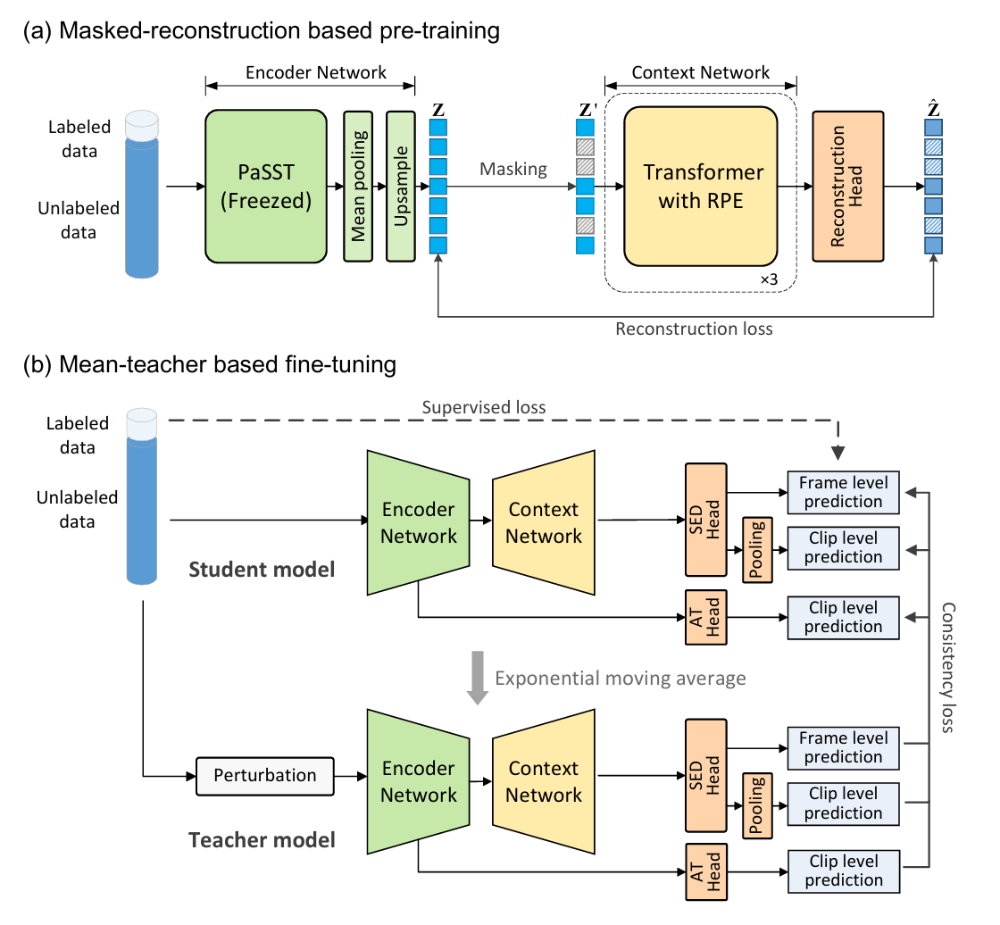
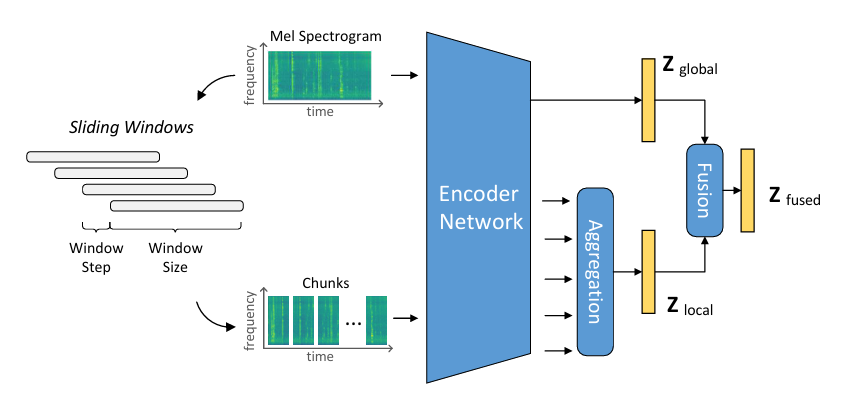

# Transformer4SED
[](https://paperswithcode.com/sota/sound-event-detection-on-desed?p=mat-sed-amasked-audio-transformer-with-masked)

Implementations of "[MAT-SED: A Masked Audio Transformer with Masked-Reconstruction Based Pre-training for Sound Event Detection](https://www.isca-archive.org/interspeech_2024/cai24_interspeech.html)" (accepted by Interspeech 2024).


❗ News: The introduction of [PMAM](https://arxiv.org/abs/2409.17656), our latest work (submitted to ICASSP2025) has been updated to the [./recipes/pmam](./recipes/pmam/readme.md) subdirectory in this repository.

## Introduction
MAT-SED (**M**asked **A**udio **T**ransformer for **S**ound **E**vent **D**etection) is a pure Transformer-based SED model.
-  MAT-SED comprising two main components: the encoder network (green) and the context network (yellow), both of which are based on Transformer structures.
- The Transformer structures lack some of the inductive biases inherent to RNNs, such as sequentiality, which makes the Transformer-based context networks do not generalize well when trained on insufficient data. To address this problem, we use the **masked-reconstruction task** to pre-train the context network in the self-supervised manner.
<div align="center"></div>

- During the semi-supervised fine-tuning stage, we propose a novel strategy 
 termed **global-local feature fusion strategy**,  as depicted in the below figure, to combine both local and global characteristics.
<div align="center"></div>

## Runing
1. First you need to use the global replacement function, which is supported by most IDEs, to replace `ROOT-PATH` with your custom root path of the project.

2. Download pretrained PaSST model weight, if you have not downloaded it before.
```shell
wget -P ./pretrained_model  https://github.com/kkoutini/PaSST/releases/download/v0.0.1-audioset/passt-s-f128-p16-s10-ap.476-swa.pt
``` 

3. Run the training script.
``` shell
cd  ./exps/mat-sed/base
./train.sh
```

## Results
DESED validation set
| Post Processing                   | PSDS1 | PSDS2 |
| --------------------------------- | ----- | ----- |
| Median Filter                     | 0.587 | 0.792 |
| Max Filter                        | 0.090 | 0.896 |
| Event Bounding Boxes <br />(SEBB) | 0.602 | -     |


## Others
- It is worth noting that our code is implemented using pytorch, refactored from the DCASE official pytorch-lighting baseline. If you feel that the baseline implementation with pytorch-lighting is not flexible, then developing on the basis of this code may be a good choice.

-  Multi-GPU training via `nn.DataParallel()` is supported.
- The **self-supervised paradigm** has shown great potential in our work. However, our efforts have only begun to harness the power of self-supervised methods. There remains much to explore in self-supervised approaches tailored for the frame-level audio tasks like sound event detection, and we believe that this is a promising area for future research.
- Welcome to ask in the issues if any problem is encountered during code reproduction.

## Citation
```
@inproceedings{cai24_interspeech,
  title     = {MAT-SED: A Masked Audio Transformer with Masked-Reconstruction Based Pre-training for Sound Event Detection},
  author    = {Pengfei Cai and Yan Song and Kang Li and Haoyu Song and Ian McLoughlin},
  year      = {2024},
  booktitle = {Interspeech 2024},
  pages     = {557--561},
  doi       = {10.21437/Interspeech.2024-714},
  issn      = {2958-1796},
}
```
