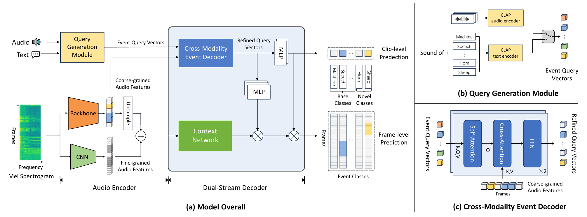
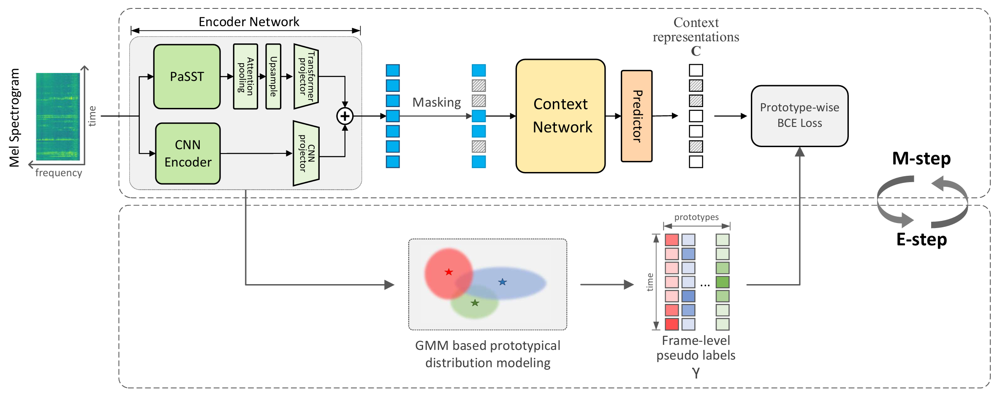
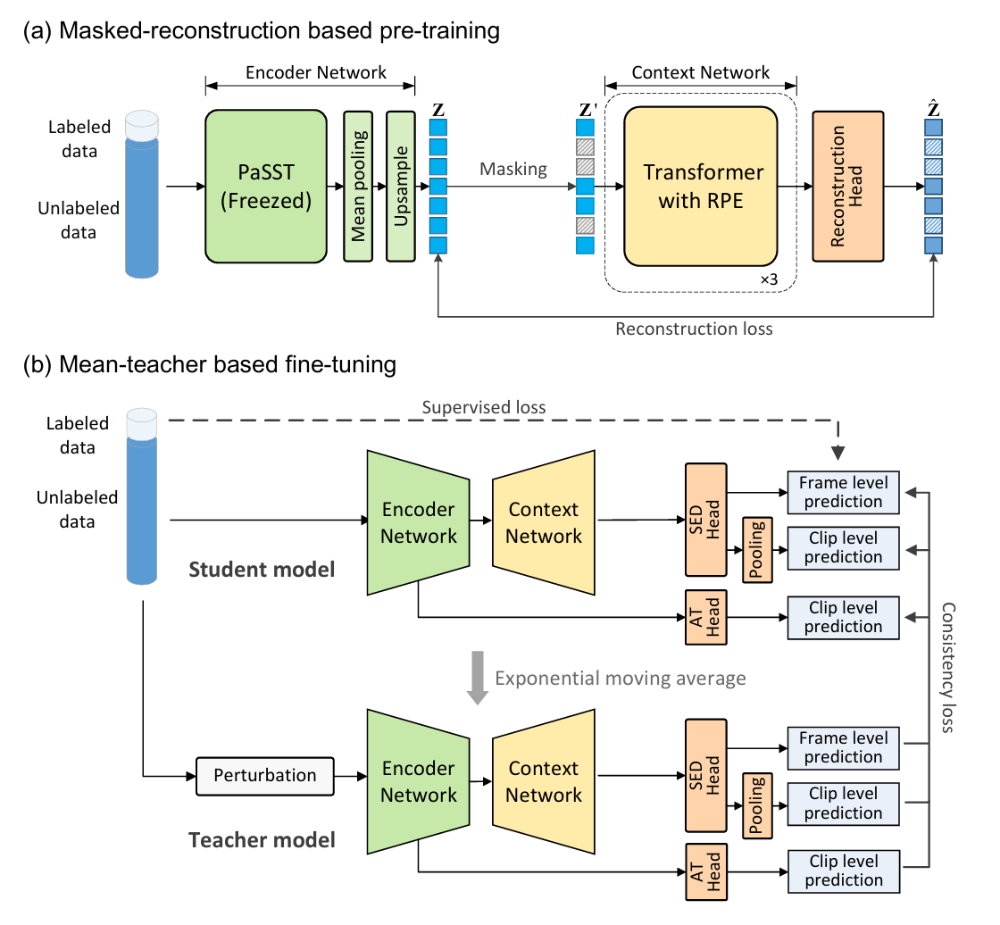

# Transformer4SED
Transformer4SED is a  repository which aims to collect Transformer-based sound event detection (SED) algorithms. 

## Features

- Implemented using pytorch, refactored from the DCASE official pytorch-lighting baseline
- Kaldi style recipes;
- [TODO] Support for commonly used datasets in the sound event detection field, including DESED, MAESTRO, audioset-strong, etc.

## recipes

### [DASM (MM 2025)](./docs/DASM/readme.md)
Traditional sound event detection algorithms can only recognize pre-defined audio events from the training set and are incapable of detecting unseen categories, which greatly limits their applicability in real-world scenarios. In this work, we propose a model named "Detect Any Sound", an open-vocabulary sound event detection system that enables the detection of arbitrary sound events guided by multi-modal queries such as text or audio. Experimental results demonstrate that the proposed method not only exhibits strong open-vocabulary detection capabilities but also retains the fine-grained detection performance of closed-set models.

### [PMAM (ICASSP 2025)](./docs/pmam/readme.md)

Prototype based Masked Audio Model (PMAM) is a self-supervised representation learning algorithm designed for frame-level audio tasks like sound event detection, to better exploit unlabeled data. 

### [MAT-SED (interspeech 2024)](./docs/mat-sed/readme.md)

MAT-SED (Masked Audio Transformer for Sound Event Detection) is a pure Transformer-based SED model with masked-reconstruction-based pre-training.

