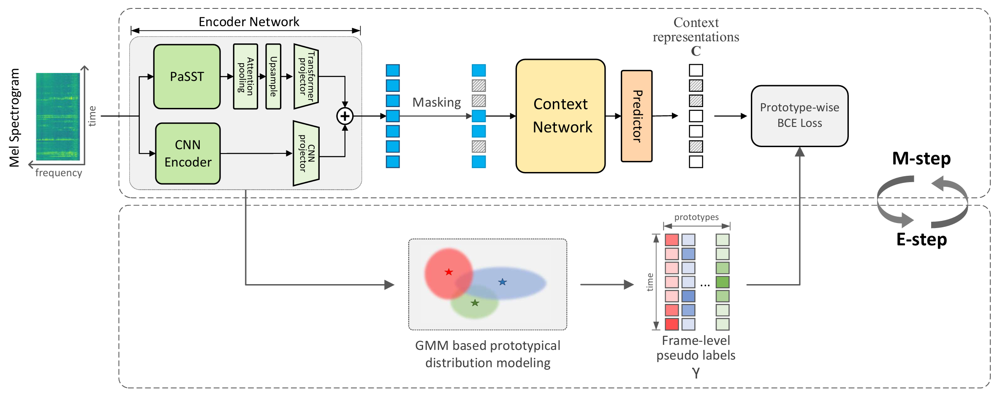

# PMAM
**P**rototype based **M**asked **A**udio **M**odel (PMAM) is a self-supervised representation learning algorithm designed for frame-level audio tasks like sound event detection, to better exploit unlabeled data. 
 

 

- Semantically rich frame-level pseudo labels are constructed from a Gaussian mixture model (GMM) based <u>prototypical distribution modeling</u>;
- The pseudo labels supervise the learning of a Transformer-based <u>masked audio model</u>;
-  The prototypical distribution modeling and the masked audio model training
 are performed iteratively to enhance the quality of pseudo labels, similar to E-step and M-step in the <u>expectation-maximization (EM) algorithm</u>;
- A novel <u>binary cross-entropy loss</u> is employed instead of the widely used InfoNCE loss, to provide independent loss contributions from different prototypes;
